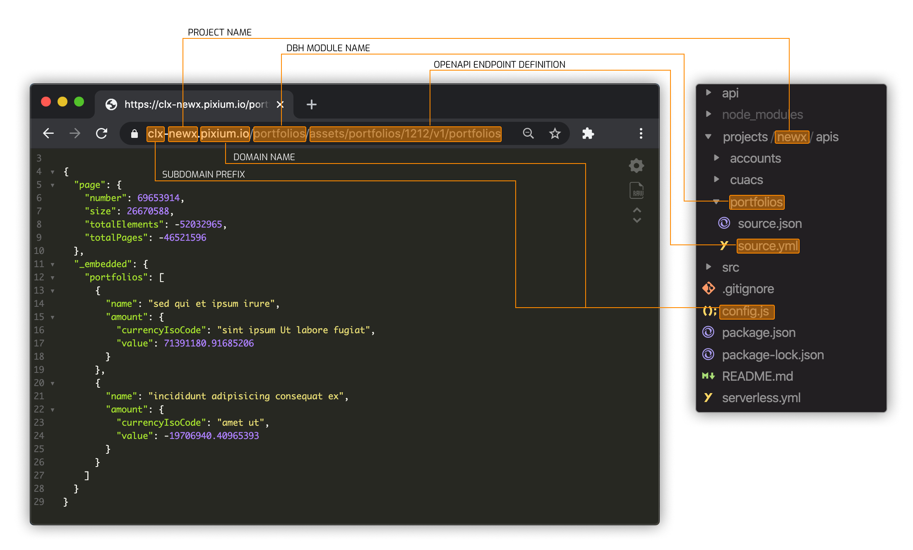

### What about this project?

This Tool create a mock server based on OpenAPI v2/v3 Squema files.

### Tech Stack :rocket:

- **AWS Services**
- **Serverless Framework:** Serverless, Simplified.
- **json-schema-faker:** JSON Schema Faker combines JSON Schema standard with fake data generators, allowing users to generate fake data that conform to the schema.

### Endpoint URL Formation

